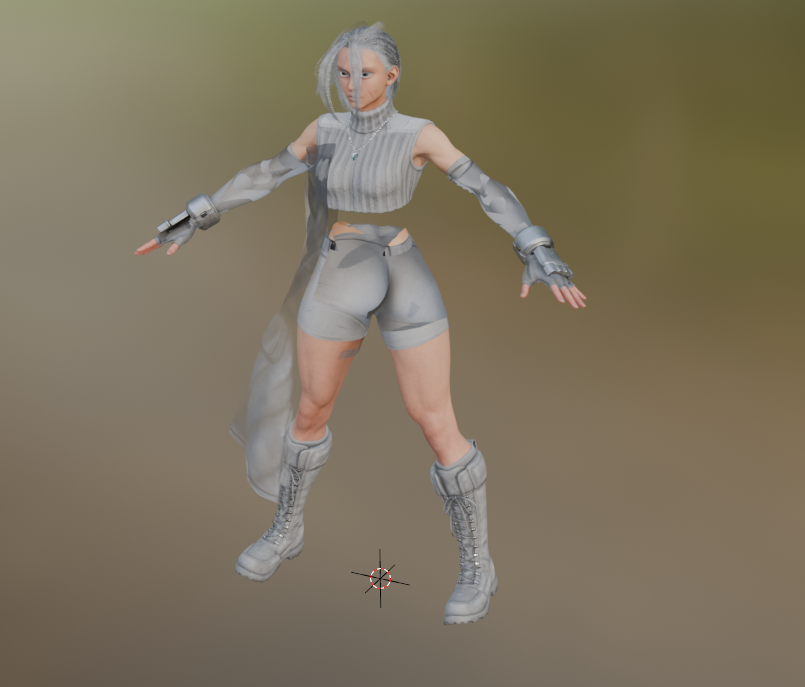
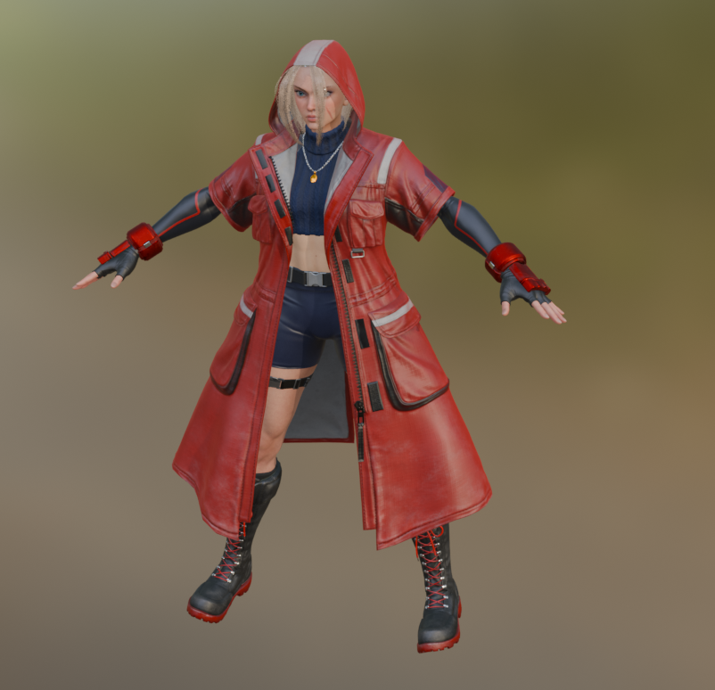

# REME - RE Mesh Editor Community Edition

An actively maintained Blender addon for importing and exporting RE Engine meshes, materials, textures and related data.

REME continues NSACloud's original RE Mesh Editor with compatibility fixes, newer-format support and expanded Street Fighter 6 material reconstruction.

[](https://github.com/TrueShadow01/REME/releases/latest)
[](https://github.com/TrueShadow01/REME/releases)
[](LICENSE)

## Status

- Actively maintained
- Supports Blender 4.3.2 through 4.5, Blender 5.0 is not tested yet
- Blender 5.1 is not currently supported
- Newer-game formats and some blend-shape paths remain experimental

## Requirements
- Blender 4.3.2 or higher

## Installation

1. Download the addon RAR from the [latest release](https://github.com/TrueShadow01/REME/releases/latest)
2. Do not extract the archive
3. In Blender, open **Edit → Preferences → Add-ons**
4. Disable the original RE Mesh Editor Addon if it is installed
5. Click the menu in the upper-right corner and choose **Install from Disk**
6. Select the `REME.rar` file
7. Enable **RE Mesh Editor (Community Maintained)**

## Visual Comparison

REME improves alpha transparency, hair materials, face details and texture handling for Street Fighter 6 and newer RE Engine Games.

### Street Fighter 6 - Cammy Outfit 3

<table>
    <tr>
        <th>Original Addon</th>
        <th>REME Addon</th>
    </tr>
    <tr>
        <td>
            
            <p><sub>Missing materials and incorrect transparency</sub></p>
        </td>
        <td>
            
            <p><sub>Reconstructed materials and corrected transparency</sub></p>
        </td>
    </tr>
</table>

## Features

### General

- Import and export supported RE Engine `.mesh` files
- Import materials and texture bindings
- Import supported blend shapes as Blender shape keys
- Batch export tools
- Presets for multiple RE Engine games
- Texture and material helper tools

### Street Fighter 6

- Experimental material reconstruction
- CMD costume-color parsing
- CMASK and CMASK2 color support
- Cloth shading and body-detail reconstruction
- Hair tinting and shared-head material support
- StitchMap reconstruction with configurable tiling, AO, normals, roughness and color variation

### Experimental Newer-Format Support

- Monster Hunter Wilds mesh import
- Preliminary mappings for newer RE Engine titles

## Game And Format Support

The following versions are explicitly recognized by the addon. Support can vary by asset type, shader and game update.

| Game | Internal Name | MESH Version | MDF Version | TEX Version | Status |
|---|---|---:|---:|---:|---|
| Devil May Cry 5 | `DMC5` | `1808282334` | `10` | `11` | Supported |
| Resident Evil 2 | `RE2` | `1808312334` | `10` | `10` | Supported |
| Resident Evil 3 | `RE3` | `1902042334` | `13` | `190820018` | Supported |
| Resident Evil Village / RE:Verse | `RE8` | `2101050001` / `2102020001` | `19` / `20` | `30` | Supported |
| Resident Evil 2/3 Ray Tracing | `RE2RT` / `RE3RT` | `2109108288` | `21` | `34` | Supported |
| Resident Evil 7 Ray Tracing | `RE7RT` | `220128762` | `21` | `35` | Supported |
| Monster Hunter Rise / Sunbreak | `MHRSB` | `2109148288` | `23` | `28` | Supported |
| Resident Evil 4 | `RE4` | `221108797` | `32` | `143221013` | Supported |
| Street Fighter 6 | `SF6` | `230110883` | `31` | `241101895` | Supported |
| Dragon's Dogma 2 | `DD2` | `231011879` / `240423143` | `40` | `760230703` | Supported |
| Kunitsu-Gami | `KG` | `240306278` | `40` | `231106777` | Limited validation |
| Dead Rising Deluxe Remaster | `DR` | `240424828` | `40` | `240606151` | Limited validation |
| Onimusha 2 | `ONI2` | `240827123` | `46` | `240701001` | Limited validation |
| Monster Hunter Wilds | `MHWILDS` | `241111606` | `45` | `241106027` | Experimental |
| Monster Hunter Stories 3 | `MHS3` | `250604100` | `49` | `251111100` | Preliminary |
| Pragmata | `PRAG` | Not enabled | `51` | `250813143` | Preliminary |
| Resident Evil 9 / Requiem | `RE9` | `250925211` | `51` | `250813143` | Preliminary |

“Supported” means the corresponding format versions have importer mappings. It does not guarantee perfect reconstruction of every material, effect, animation or blend shape.

## Street Fighter 6 Support

Street Fighter 6 material import is experimental. The addon can reconstruct costume colors from extracted CMD `.user.2` files and apply them to supported MDF materials.

### Import Options

- **SF6 Costume Index** selects the costume folder containing the CMD files. For example, `1` selects folder `001`.
- **SF6 Color Index** selects the CMD color file. For example, `1` selects `cmd_001.user.2`.

Shared character meshes stored under costume folder `000` can use CMD data from the selected costume folder.

Example for Costume 2, Color 1:

```text
SF6 Costume Index: 2
SF6 Color Index: 1
```

## Known Limitations
- Blender 5.1 is not currently supported
- Monster Hunter Wilds support remains experimental
- Blend-shape support varies by game and mesh format
- SF6 blend shapes are kept at zero by default
- Automatic SF6 JCNS pose-corrective drivers are disabled while their vertex mapping remains experimental
- SF6 `FakeSqhereMap` eye reflections are not supported yet
- Extreme FK poses may not match the game's deformation without pose-corrective shapes
- The imported skeleton does not include custom IK or animator-facing controls
- Blend-shape export is not guaranteed for every supported import path
- Damage, sweat, animated muscle, cloth-wave and some auxiliary SF6 effects are not reconstructed

## Roadmap

### Near Term
- Validate Street Fighter 6 materials across more fighters, costumes, color variants and shader types
- Add automated regression tests for CMD parsing and material matching
- Improve texture import reliability and support for newer compression formats
- Validate compatibility with RE2, RE3, RE4R, RE7RT and newer RE Engine titles

### Mesh And Format Support
- Validate Monster Hunter Wilds mesh import across more character, armor, weapon and environment assets
- Regression test legacy mesh and blend-shape import paths
- Continue investigating blend-shape / shape-key export support
- Improve support for newer mesh/material variations used by SF6, PRAGMATA, MH Wilds and future RE Engine games
- Reduce hardcoded format assumptions where possible

### Code Quality
- Refactor shader and material generation for easier maintenance
- Improve import/export performance
- Expand documentation for contributors and testers

---

**Contributing**: If you're interested in tackling any of these areas, feel free to open an issue or PR.

## Credits
- [Ando](https://github.com/Andoryuuta) - Solving the compression format for MH Wilds textures.
- [AsteriskAmpersand](https://github.com/AsteriskAmpersand) - Mesh format research and tex conversion code
- [AlphaZomega](https://github.com/alphazolam/) - RE Mesh 010 Template and Noesis plugin
- [CG Cookie](https://github.com/CGCookie) - Addon updater module
- [matyalatte](https://github.com/matyalatte/Texconv-Custom-DLL) - DirectX Texconv DLL library
- [PittRBM](https://x.com/wDnrbm) - NRRT texture node setup
- Ridog - NRRT normal conversion code used as reference
- [NSACloud](https://github.com/NSACloud) - Original RE-Mesh-Editor Plugin Author
